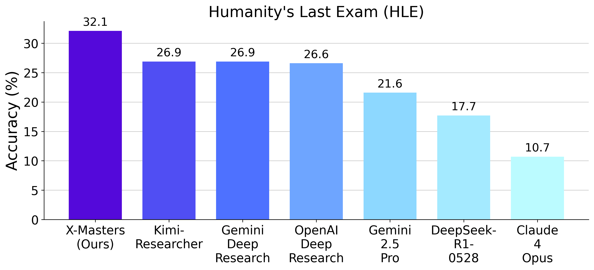

# X-Master: Can We Lead on Humanity’s Last Exam?

This is the official implementation of X-Master, a general-purpose tool-augmented reasoning agent.

## Key Features

- 🧠 **Interact with Environments during Reasoning**: X-Master emulates human researchers by fluidly pivoting between internal reasoning and external tool use.

- 💻 **Code as Interaction Language**: X-Master communicates its intentions and interacts with environments—including Python libraries, custom tools, and even self-generated code—by formulating precise Python code snippets.

- 🔬 **Scattered-and-Stacked Workflow**: X-Masters enhances problem-solving performance by strategically increasing both the breadth of exploration and the depth of reasoning.
