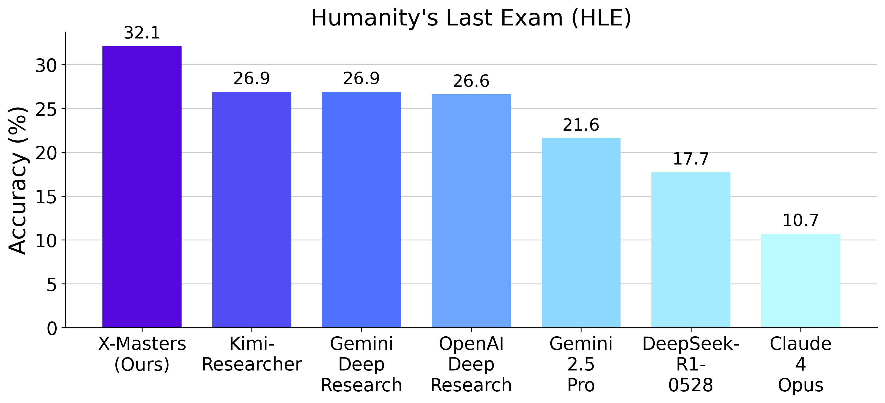

# X-Master: Can We Lead on Humanity’s Last Exam?

<p align="center">
📑 <a href="https://arxiv.org/pdf/2507.05241" target="_blank">ArXiv Paper</a>
</p>

## 🔥 News
- [2025/08/22] Initial codes of X-Master is now available on GitHub!
- [2025/07/26] Play with our [SciMaster](https://scimaster.bohrium.com), a general-purpose scientific AI agent product!

This is the official implementation of X-Master, a general-purpose tool-augmented reasoning agent.



## Key Features

- 🧠 **Interact with Environments during Reasoning**: X-Master emulates human researchers by fluidly pivoting between internal reasoning and external tool use.

- 💻 **Code as Interaction Language**: X-Master communicates its intentions and interacts with environments—including Python libraries, custom tools, and even self-generated code—by formulating precise Python code snippets.

- 🔬 **Scattered-and-Stacked Workflow**: X-Masters enhances problem-solving performance by strategically increasing both the breadth of exploration and the depth of reasoning.

## Examples
- Some response examples for each HLE category are in ```logs/example.jsonl```. 

## 🚀 QuickStart
### Environment Setup
First install requirements using the following command.
```
conda create -n xmaster python=3.10
conda activate xmaster
pip install -r requirements.txt
cd src
pip install -e.
```

---
### MCP Tools
We are working on the codes related to MCP tools, which will be released soon.

---
### X-Master Configuration
1. Set DeepSeek-R1-0528 model url and ToolBox url in ```configs/common_config.py```.
    > Note that we use locally deployed [DeepSeek-R1-0528](https://huggingface.co/deepseek-ai/DeepSeek-R1-0528) model, instead of api.

2. For [Humanity's Last Exam (HLE)](https://agi.safe.ai/) evaluation, set o3-mini api in ```configs/common_config.py```.

---
## Run X-Masters
Before running X-Masters, ensure that the environment, toolbox, and configuration are properly set up. We provide the text-only subset of HLE in `data/hle.json`.
- For single query inference with X-Masters, run
  ```
  python -m agents.XMaster.xmaster_agent --query "YOUR_QUERY"
  ```
- For X-Masters on HLE benchmark, 
  - Generate solutions using X-Masters workflow.
    ```
    python -m functions.xmaster_hle
    ```
  - Evaluate generated solutions using o3-mini.
    ```
    python utils/hle_score.py
    ```

## Citation
```
@article{xmaster,
  title={SciMaster: Towards General-Purpose Scientific AI Agents, Part I. X-Master as Foundation: Can We Lead on Humanity's Last Exam?},
  author={Jingyi, Chai and Tang, Shuo and Ye, Rui and Du, Yuwen and Zhu, Xinyu and Zhou, Mengcheng and Yanfeng, Wang and E, Weinan and Chen, Siheng},
  journal={arXiv preprint arXiv:2507.05241},
  year={2025}
}
```
